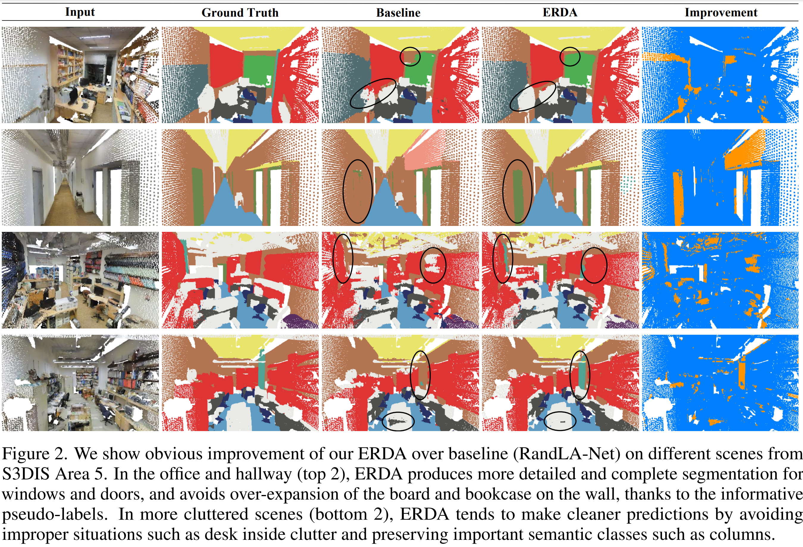

# All Points Matter: Entropy-Regularized Distribution Alignment for Weakly-supervised 3D Segmentation (NeurIPS 2023)
By Liyao Tang, Zhe Chen, Shanshan Zhao, Chaoyue Wang, and Dacheng Tao

This is the implementation of our NeurIPS 2023 paper: <br>
**All Points Matter: Entropy-Regularized Distribution Alignment for Weakly-supervised 3D Segmentation**
[[arXiv](https://arxiv.org/abs/2305.15832)]
<!-- [[OpenReview](https://openreview.net/forum?id=utQms7PPx5)] -->


If you find our work useful in your research, please consider citing:

```
@inproceedings{tang2023erda,
    title={All Points Matter: Entropy-Regularized Distribution Alignment for Weakly-supervised 3D Segmentation},
    author={Tang, Liyao and Chen, Zhe and Zhao, Shanshan and Wang, Chaoyue and Tao, Dacheng},
    booktitle={Thirty-seventh Conference on Neural Information Processing Systems},
    year={2023},
    url={https://openreview.net/forum?id=utQms7PPx5}
}
```

## Quantitative results

S3DIS (Area 5) in mIoU, under 1% labeled points and fully-supervised settings.

| methods             | 1%   | fully |
|---------------------|------|-------|
| RandLA-Net + ERDA   | 67.2 | 68.3  |
| CloserLook3D + ERDA | 68.2 | 69.6  |
| PT + ERDA           | 70.4 | 72.6  |


## Qualitative results



## Setup & Usage

This code has been tested with Python 3.7, Tensorflow 1.14, CUDA 10.0 and cuDNN 7.4.1 on Ubuntu 16.04.

### Installation
- clone the repo.

        git clone https://github.com/LiyaoTang/ERDA
        cd ERDA

- Setup python environment and install dependencies.

        conda create -n erda python=3.7
        conda activate erda
        conda install -f py_requirements.txt

- Follow [Tensorflow installation procedure](https://www.tensorflow.org/install).

- Compile the customized tf ops.

        bash compile_ops.sh

### Dataset Preparation

- **S3DIS** dataset can be found [here](https://goo.gl/forms/4SoGp4KtH1jfRqEj2). Download the files named "Stanford3dDataset_v1.2_Aligned_Version.zip". Uncompress the folder and move it to be under `Data/S3DIS`.

- **ScanNet** dataset can be downloaded following the instruction [here](http://kaldir.vc.in.tum.de/scannet_benchmark/documentation) in requesting and using its download script. <br>
We need to download four types of files: `.txt`, `_vh_clean_2.ply`, `_vh_clean_2.0.010000.segs.json` and the `.aggregation.json`. We also need its label map file `scannetv2-labels.combined.tsv` (via script download) and [scannetv2_val.txt](https://github.com/ScanNet/ScanNet/tree/master/Tasks/Benchmark). <br>
Then, move all files/directories to be under `Data/ScanNet`. <br>
Note that, to run with weak supervision, one may need to manually convert the provided annotation points from `.pth` into `.npy`, which can be done via `python` terminal:

        >>> from config.scannet import default as cfg
        >>> from datasets import get_dataset
        >>> scannet_dataset = get_dataset(cfg)
        >>> scannet_dataset.preprocess_weaksup()

- **SensatUrban** dataset can be downloaded following the instructions [here](https://github.com/QingyongHu/SensatUrban). Download and move all files/directories to be under `Data/SensatUrban`.

Note: The data will be pre-processed and cached at the first time of the running, which may take some time.
While our code borrows methods from previous works for data processing and is generally compatible with them, we still recommend to re-process the data due to some of the modifications.

### Training

Simply run the following script to start the training:

    python main.py -c path/to/config --mode train --gpus [num gpus]

All configs are provided under `config/`. <br>
For more options, please check the `main.py` as well as the config files to play around.

For example, to train on S3DIS dataset using RandLA-Net + ERDA using 2 gpus, run the following command:

    python main.py -c config/s3dis/randla_erda.yaml --gpus 2

Note that, by default, the log will be saved under the path `results/[dataset_name]/[model_name]/Log_[date]-[time]`.


### Testing
Simply provide the training command with `mode=test` and the `path` for finding saved model, i.e.

    python main.py -c path/to/config --mode test --model [path]

**Pretrained models** can be accessed [here](https://drive.google.com/drive/folders/1n5jryQUVWNQ-YyQeciq7FqPrA-dcDdpq?usp=sharing), together with their logs. Choose the desired baseline and unzip into the corresponding code directory and provide it to the testing command. <br>
For example, to test on S3DIS dataset with the pretrained RandLA-Net baseline:

    python main.py -c config/s3dis/randla_erda.yaml --mode test --model results/s3dis/randla_erda/Log_pretrain

For more specific usage, please consult the `main.py`.


## Acknowledgement
This repo is built based on a series of previous works, including
[KPConv](https://github.com/HuguesTHOMAS/KPConv), 
[RandLA-Net](https://github.com/QingyongHu/RandLA-Net), 
[CloserLook3D](https://github.com/zeliu98/CloserLook3D), 
[Point-Transformer](https://github.com/POSTECH-CVLab/point-transformer). 
Thanks for their excellent work.


## License
Licensed under the MIT license, see [LICENSE](./LICENSE).
