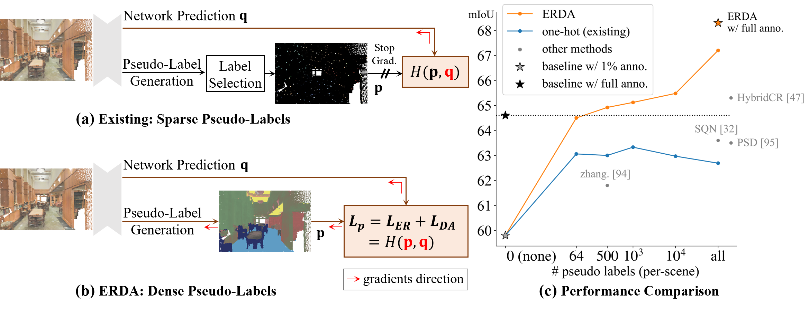

# All Points Matter: Entropy-Regularized Distribution Alignment for Weakly-supervised 3D Segmentation (NeurIPS 2023)
By Liyao Tang, Zhe Chen, Shanshan Zhao, Chaoyue Wang, and Dacheng Tao

This is the implementation of our NeurIPS 2023 paper: <br>
**All Points Matter: Entropy-Regularized Distribution Alignment for Weakly-supervised 3D Segmentation**
[[arXiv](https://arxiv.org/abs/2305.15832)]
<!-- [[OpenReview](https://openreview.net/forum?id=utQms7PPx5)] -->




If you find our work useful in your research, please consider citing:

```
@inproceedings{tang2023erda,
    title={All Points Matter: Entropy-Regularized Distribution Alignment for Weakly-supervised 3D Segmentation},
    author={Tang, Liyao and Chen, Zhe and Zhao, Shanshan and Wang, Chaoyue and Tao, Dacheng},
    booktitle={Thirty-seventh Conference on Neural Information Processing Systems},
    year={2023},
    url={https://openreview.net/forum?id=utQms7PPx5}
}
```

## Setup & Usage
Coming soon ...

## Pre-trained models
Coming soon ...

## Quantitative results

S3DIS (Area 5) in mIoU, under 1% labeled points and fully-supervised settings.

| methods             | 1%   | fully |
|---------------------|------|-------|
| RandLA-Net + ERDA   | 67.2 | 68.3  |
| CloserLook3D + ERDA | 68.2 | 69.6  |
| PT + ERDA           | 70.4 | 72.6  |

## Qualitative results


## Acknowledgement
Codes are built based on a series of previous works, including
[KPConv](https://github.com/HuguesTHOMAS/KPConv), 
[RandLA-Net](https://github.com/QingyongHu/RandLA-Net), 
[CloserLook3D](https://github.com/zeliu98/CloserLook3D), 
[Point-Transformer](https://github.com/POSTECH-CVLab/point-transformer). 
Thanks for their excellent work.


## License
Licensed under the MIT license, see [LICENSE](./LICENSE).
